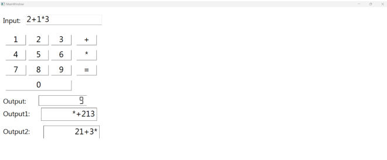
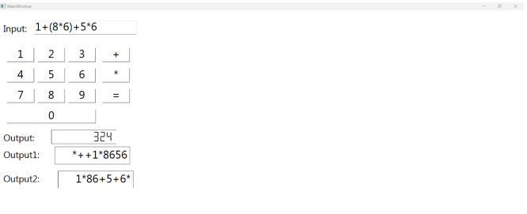

# Calculator Project

## Submitted by Nont st124335

This is the project for the Programming Language and Compiler course @ AIT. 
2024, I have used `Python`.

## Dependencies
- Python version 3.11.7
- `sly` as a submodule [link](https://github.com/dabeaz/sly)
- `PyQt6` for GUI development

## To use

### Run on Docker (preferred)

Once you install `Docker` in your system, you can do the following.

1. (Optional) Click `Use this template` on the top right of this page to clone this to your repository.
2. Clone the project to your local machine.
3. Clone submodule with this `git submodule update --init --recursive`.
4. (Optional) Install X11Client if you want to use GUI in docker. 
   - For `Windows`: [X410](https://x410.dev) is the best but you will need to pay. 
   - For `Mac`: [XQuartz](https://www.xquartz.org) is the one I used. 
   - For `Linux`/`Ubuntu`: You can simply map `DISPLAY`. No additional app is needed.
5. Run `docker compose up -d --build` to build and run the container.
6. Use `VSCode` to dev the project remotely.

### Run on Local Machine

1. Clone this repo by using command `git clone https://github.com/Nont18/Dung-calculator.git`        
2. If you did not install PyQt6, then you can use `pip install PyQt6` and `pip install pyqt6-tools`          
3. If PyInstaller and PyQt6 are installed in different environments. Try running: `python -m pip install pyinstaller pyqt6` and `python -m PyInstaller question.py` or see discussion from https://github.com/pyinstaller/pyinstaller/issues/7122          
4. Once you already cloned the repo, you can `cd .\src\`       
5. type `python main.py` to run the project locally.    


## Code Explain

Inside `src/` folder is all the code developed.

```txt
src/
  |- components/
      |- ast/
          |- statement.py
      |- lexica.py
      |- main.ui
      |- memory.py
      |- parsers.py
  |- main.py
  |- Pipfile
  |- Pipfile.lock
```

Since the project is done just to showcase libraries and techniques, here we divided it into subsections to explain the code.

### components/lexica.py

This file showcases the Lexica analyzer component. It has a `MyLexer` class that extends `sly.Lexer`.
It will translate a code/string into `token` stream/generator that feeds to a `Parser`.
This file has a main just for testing the class.

### components/parsers.py

There are two parsers.
(1) `MyParser` and (2) `ASTParser`.

#### MyParser class

This class is what I call immediate evaluation which each of the semantics, once reduced, evaluates/calculates right away.
This type of parser is fine for calculator projects or simple parsing.
This parser also implements [`Memory`](#componentsmemorypy) and `Variable assignment`. 


#### ASTParser class

This is a more complex but flexible way of parsing.
[AST (Abstract Syntax Trees)](https://en.wikipedia.org/wiki/Abstract_syntax_tree) is actually a parse tree.
This will allow you to control when to run a subsection of code like `if-else` statement.
You can see that the semantic part is only creating an object inside `components.ast`.
All the logic (in this case, addition and subtraction) is in the AST object.
The Parser is there is create a parse tree that once ready will execute `.run()`. 
I only add the essentials to demonstrate this technique.

### components/memory.py

This contains `Memory` class which is a singleton.
Inside is just a simple dictionary where `variable_name` is a key and `{'value':value,'data_type':<type>}` as a value.
Whether this solution is appropriate or not is your judgment.


### main.py and components/main.ui

Finally, the `main.py` is the main file to run the entire project.
It will render a GUI from `components/main.ui` that was designed from `PyQt6`.
This shows how to bind a function with a button and how to display the result back to the GUI.

## Design a GUI

I use `PyQt6` and `qt designer 6` for GUI.
You can start to learn this tool from [here](https://www.pythonguis.com/tutorials/pyqt6-first-steps-qt-designer/#:~:text=To%20load%20.,a%20fully%2Dfunctional%20PyQt6%20object).

To launch `QT designer`, use `pipenv run pyqt6-tools designer` and to open the existing UI use `pipenv run pyqt6-tools designer <path/to/file.ui>`

## Sample of usage



](imag/Capture1.PNG)